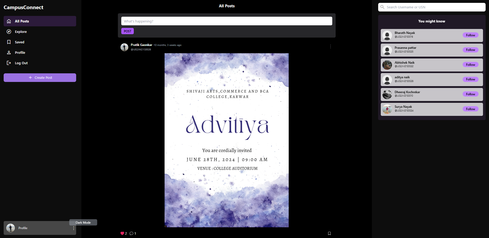

# University Management Web Application



This is a Django-based web application designed to manage university-related operations with modern animations and a user-friendly interface.

## 🚀 Features

### ✅ Authentication System
- **User Registration**: Secure sign-up functionality with animated UI using `signup_animation.svg`.
- **User Login**: Secure sign-in system featuring animated visuals from `login_animation.svg`.
- **Session Management**: Secure handling of user sessions and logout functionality.

### 🏛️ University Dashboard
- **University Overview**: Displays structured and visually enhanced data using `university.svg`.
- **Dynamic Content**: Content is rendered dynamically based on authenticated user roles (Admin, Staff, Students).

### 🖼️ SVG Animations
- Integrated Lottie-style SVG animations for:
  - Login screen (`login_animation.svg`)
  - Sign-up screen (`signup_animation.svg`)
  - University-themed dashboard (`university.svg`)

### ⚙️ Built With
- **Backend**: Django 4.x+
- **Frontend**: HTML, CSS, JavaScript (with SVG animation support)
- **Database**: SQLite (default Django configuration, customizable)

## 📂 Project Structure

```
project_root/
│
├── manage.py
├── project4/                # Django settings module
├── app_name/                # Replace with your Django app name
│   ├── models.py
│   ├── views.py
│   ├── urls.py
│   └── templates/
│       ├── login.html       # Uses login_animation.svg
│       ├── signup.html      # Uses signup_animation.svg
│       └── dashboard.html   # Uses university.svg
├── static/
│   └── animations/
│       ├── login_animation.svg
│       ├── signup_animation.svg
│       └── university.svg
```

## 🛠️ Setup Instructions

1. **Clone the repository**
   ```bash
   git clone https://github.com/yourusername/university-management.git
   cd university-management
   ```

2. **Create a virtual environment**
   ```bash
   python -m venv env
   source env/bin/activate  # On Windows use `env\Scripts\activate`
   ```

3. **Install dependencies**
   ```bash
   pip install -r requirements.txt
   ```

4. **Apply migrations**
   ```bash
   python manage.py migrate
   ```

5. **Run the server**
   ```bash
   python manage.py runserver
   ```

6. **Access the app**
   Visit [http://127.0.0.1:8000](http://127.0.0.1:8000/) in your browser.

## 📌 Notes

- Ensure the static files are correctly linked in your templates.
- If using animations with Lottie, you may need to integrate a JS library like `lottie-web`.

## 📄 License

This project is licensed under the MIT License.
